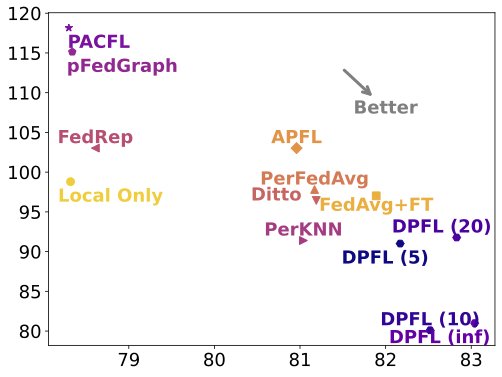

# DPFL: Decentralized Personalized Federated Learning (AISTATS'25)
This repository contains the code and experiments for the manuscript:

> [DPFL: Decentralized Personalized Federated Learning](https://arxiv.org/abs/2406.06520)

DPFL is a bi-level optimization framework designed to tackle data heterogeneity and communication constraints in decentralized federated learning (FL). Unlike traditional FL, which relies on a central server, DPFL enables direct collaboration between clients by constructing an optimized collaboration graph. Using a constrained greedy algorithm, DPFL selects beneficial collaborators to enhance personalized model training while adhering to resource limitations.

## Key Features
- **Targeted Collaboration:** Clients form efficient, personalized collaborations based on combinatorial relationships.
- **Adaptive Graph Optimization:** Dynamically updates the collaboration structure to maximize learning benefits.
- **Scalability & Efficiency:** Reduces communication overhead while outperforming existing FL methods on diverse datasets.

Experiments demonstrate DPFL’s superior performance in handling non-IID data, improving personalization, and optimizing resource usage in real-world decentralized learning scenarios.


<p>
    
    
</p>

The figures show that our method (DPFL) is situated in the right-bottom corner across all variants of budget constraints. This positioning signifies that, compared to other methods, our approach achieves superior average test accuracy and lower variance between local models. 

## 2. Dependencies
The code requires Python >= 3.6 and PyTorch >= 1.2.0. To install the other dependencies: 

```
conda env create -f environment.yml
```

## 3. Datasets
This code uses the CIFAR10, Federated Extended MNIST (FEMNIST), and CINIC datasets.

The CIFAR10 dataset is downloaded automatically by the torchvision package. 
FEMNIST is provided by the LEAF repository, which should be downloaded from https://github.com/TalwalkarLab/leaf/. 
CINIC is downloaded from the following link: https://datashare.is.ed.ac.uk/bitstream/handle/10283/3192/CINIC-10.tar.gz.

## 4. Training and Testing
Run:
`HYDRA_FULL_ERROR=1 python3 main.py gpus=[0] client=?? train_schema=??`

For example to run our algorithm with each client having at most 20 collaborators (cardinality=20): 

```
HYDRA_FULL_ERROR=1 python3 main.py gpus=[0] client=client_train_celoss train_schema=train_constrained_rgl cardinality=20 
```

Before running, you can change the defaultConf.yaml under the config directory. You can specify the model (e.g cnnCifar, cnnCinic, etc.), the datamodule( e.g, cifar10, FEMNIST) and all other parameters. 

## 5. Citation

Please cite our paper if you use our implementation of DPFL:

```
@article{kharrat2024decentralized,
  title={Decentralized personalized federated learning},
  author={Kharrat, Salma and Canini, Marco and Horvath, Samuel},
  journal={arXiv preprint arXiv:2406.06520},
  year={2024}
}
```